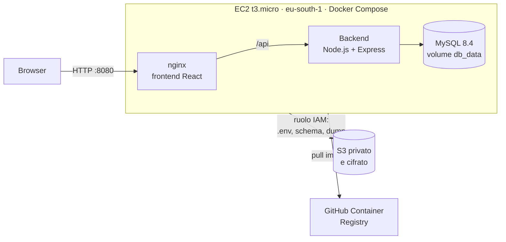
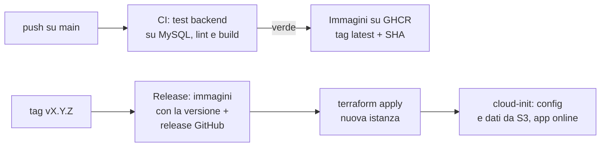

# Balloi Immobiliare

[](https://github.com/danielballoi/balloi-immobiliare/actions/workflows/ci.yml)
[](https://github.com/danielballoi/balloi-immobiliare/actions/workflows/release.yml)
[](https://github.com/danielballoi/balloi-immobiliare/releases)

Dashboard web per investimenti immobiliari a Cagliari e nell'hinterland: censimento degli immobili, valutazione con dati OMI ufficiali (Osservatorio del Mercato Immobiliare) e gestione di un portafoglio di investimenti.

Oltre all'applicazione, il repository documenta il percorso per portarla **in produzione su AWS con pratiche DevOps**: container, CI/CD, release versionate, infrastruttura come codice, backup automatici e sicurezza della supply chain. Il diario giorno per giorno, con le scelte e i problemi incontrati, è in [`docs/PORTFOLIO.md`](docs/PORTFOLIO.md).

## Cosa dimostra questo progetto

- **Container**: backend e frontend in immagini Docker multi-stage, utente non-root, healthcheck; stack completo con Docker Compose.
- **CI/CD con GitHub Actions**: test Jest su un vero MySQL, lint e build a ogni push; immagini pubblicate su GitHub Container Registry solo dopo che i test passano.
- **Release versionate**: un tag `vX.Y.Z` produce immagini con quella versione e una release GitHub con changelog generato.
- **Infrastruttura come codice**: istanza EC2, security group, ruoli IAM, bucket S3 e budget descritti in Terraform.
- **Avvio senza intervento manuale**: una nuova istanza si configura da sola al primo avvio (cloud-init), recupera configurazione e ultimo backup da S3 e porta l'app online in circa 2 minuti.
- **Sicurezza**: nessun segreto nel codice né nella cronologia Git, accesso a S3 tramite ruolo IAM senza chiavi statiche, Dependabot, CodeQL, secret scanning con push protection.
- **Operatività**: backup del database su S3, runbook di diagnosi, due incidenti reali analizzati e risolti (istanza terminata per errore, memoria esaurita all'avvio).

## Architettura

### In produzione (AWS)



Un'unica istanza con tutti i servizi in Docker Compose: per un progetto con traffico minimo, separare frontend (S3 + CloudFront) e backend avrebbe aggiunto costi e complessità senza benefici misurabili. Vedi [ADR 0001](docs/decisioni/0001-hosting-aws-docker.md) e [ADR 0003](docs/decisioni/0003-istanza-singola-senza-ip-fisso.md).

### Pipeline



## Funzionalità

- **Autenticazione utenti** con login, registrazione, refresh token e sessione via cookie httpOnly; ruoli `user` e `admin`.
- **Mappa e statistiche OMI**: zone di Cagliari e hinterland con heatmap dei prezzi, statistiche per quartiere, trend storici e dettaglio per tipologia di immobile.
- **Valutazione immobili** con tre metodologie: Valutazione Comparativa di Mercato (VCM), Valutazione Reddituale, Analisi Finanziaria/DCF (VAN, TIR, ROI, Cash-on-Cash).
- **Censimento immobili**: schedatura manuale di immobili con note, stato e preferiti.
- **Portafoglio investimenti**: immobili valutati e salvati, con riepilogo KPI.
- **Locazioni**: registro degli immobili in locazione.
- **Import dati**: caricamento CSV di valori OMI, zone, NTN (Numero Transazioni Normalizzate) e inserimento manuale, con log delle importazioni (solo amministratori).
- **Stradario**: ricerca vie e quartieri di Cagliari, con statistiche collegate.
- **Segnalazioni**: gli utenti inviano segnalazioni, consultabili dagli amministratori.
- **Gestione utenze**: approvazione, blocco e riattivazione degli account (area admin).

## Stack tecnologico

| Area | Tecnologie |
|---|---|
| Backend | Node.js 22, Express 4, MySQL 8.4 (`mysql2`), `jsonwebtoken`, `bcryptjs`, `helmet`, `express-rate-limit`, `multer`, `papaparse` |
| Frontend | React 19, Vite, React Router 7, Tailwind CSS 4, Leaflet, Recharts, Axios |
| Container | Docker (build multi-stage), Docker Compose, nginx come reverse proxy |
| CI/CD | GitHub Actions, GitHub Container Registry, Dependabot, CodeQL |
| Cloud | AWS EC2, S3, IAM, EventBridge + Lambda + SNS (avviso istanza accesa), AWS Budgets |
| Infrastruttura come codice | Terraform |
| Test | Jest (logica di valutazione) |

## Avvio con Docker

Il modo più rapido per far partire l'intero sistema (database, backend e frontend) senza installare Node.js o MySQL. Servono solo Docker e Docker Compose.

1. Copia il file di esempio delle variabili d'ambiente:

```bash
cp .env.example .env
```

2. Apri `.env` e sostituisci i valori segnaposto: le password del database (`DB_ROOT_PASSWORD`, `DB_PASSWORD`), `JWT_SECRET` (si genera con `openssl rand -hex 64`) e, per creare l'account amministratore al primo avvio, `ADMIN_EMAIL` e `ADMIN_PASSWORD` (almeno 12 caratteri). Il file `.env` non viene versionato.

3. Costruisci le immagini e avvia i container:

```bash
docker compose up --build -d
```

4. Apri http://localhost:8080 e accedi con l'account amministratore configurato.

### Come è composto

- **frontend**: nginx serve l'applicazione React già compilata e inoltra le richieste `/api/` al backend (reverse proxy). È l'unico servizio raggiungibile dall'esterno, sulla porta 8080.
- **backend**: Node.js/Express, eseguito come utente non-root, con healthcheck su `/api/health`. Raggiungibile solo dalla rete interna di Compose.
- **db**: MySQL 8.4 con un volume dedicato (`db_data`) per la persistenza. Alla prima esecuzione crea le tabelle da `db/schema.sql`. Raggiungibile solo dalla rete interna.

I servizi partono in ordine (db, poi backend, poi frontend) e ognuno aspetta che il precedente sia `healthy`.

### Comandi utili

```bash
docker compose ps                # stato dei servizi
docker compose logs -f backend   # log del backend in tempo reale
docker compose down              # ferma e rimuove i container, i dati restano nel volume
docker compose down -v           # ATTENZIONE: rimuove anche il volume, cancella i dati
```

Dopo aver ricostruito il backend (`docker compose up -d --build backend`) conviene riavviare anche il frontend (`docker compose restart frontend`): nginx risolve l'indirizzo del backend solo all'avvio.

### Nota sui dati

`db/schema.sql` contiene solo la struttura delle tabelle. In locale il database parte vuoto e i dati OMI si caricano con la funzione di importazione dell'applicazione. In produzione l'istanza importa al primo avvio l'ultimo backup salvato su S3. I dati reali non sono nel repository (vedi [ADR 0002](docs/decisioni/0002-dati-istanza-online.md)).

## CI/CD e release

| Workflow | Quando parte | Cosa fa |
|---|---|---|
| [`ci.yml`](.github/workflows/ci.yml) | push e pull request verso `main` | test Jest del backend con un MySQL reale come service container, avvio del server con healthcheck, lint e build del frontend, build delle immagini e validazione del compose. Su `main`, solo se tutto è verde, pubblica le immagini su GHCR con tag `latest` e SHA del commit |
| [`release.yml`](.github/workflows/release.yml) | push di un tag `vX.Y.Z` | immagini su GHCR con la versione esatta e release GitHub con changelog generato dai messaggi di commit |
| Dependabot | ogni settimana | pull request di aggiornamento per npm, immagini Docker e GitHub Actions, con gli aggiornamenti minori raggruppati |
| CodeQL | push, pull request e ogni settimana | analisi statica del codice JavaScript e dei workflow |

Il token dei workflow ha i permessi minimi (`contents: read`); solo il job che pubblica le immagini ha `packages: write`.

Per creare una release:

```bash
git tag -a v0.3.0 -m "v0.3.0: descrizione"
git push origin v0.3.0
```

## Deploy su AWS

L'infrastruttura è in [`infra/`](infra/) (Terraform, regione `eu-south-1`).

| File | Contenuto |
|---|---|
| `ec2.tf` | istanza `t3.micro` (Amazon Linux 2023, crediti CPU `unlimited`), security group (SSH solo dagli IP in `my_ips`, app sulla 8080), chiave SSH |
| `backup.tf` | bucket S3 privato e cifrato, ruolo IAM e instance profile per l'accesso dall'istanza |
| `budget.tf` | budget mensile da 1 $ con avvisi email |
| `alert.tf` | Lambda eseguita ogni ora da EventBridge: avvisa via email se un'istanza del progetto è accesa |
| `user_data.sh` | configurazione al primo avvio (vedi sotto) |

```bash
cd infra
cp terraform.tfvars.example terraform.tfvars   # email, IP ammessi per SSH, chiave pubblica
terraform init
terraform plan
terraform apply
```

Al primo avvio `user_data.sh`, eseguito da cloud-init:

1. crea 2 GB di swap (la `t3.micro` ha 1 GB di RAM: senza swap MySQL veniva terminato dall'OOM killer durante l'import);
2. installa Docker, Docker Compose e AWS CLI;
3. scarica da S3 `.env` e `schema.sql` tramite il ruolo IAM, senza chiavi statiche;
4. legge il proprio IP pubblico dal metadata service (IMDSv2) e aggiorna `CORS_ORIGINS`, perché l'IP cambia a ogni ricreazione;
5. avvia i container con le immagini della release (MySQL in configurazione leggera) e importa l'ultimo backup del database.

Per sostituire l'istanza (per esempio dopo una modifica a `user_data.sh`, che gira solo al primo avvio):

```bash
terraform apply -replace=aws_instance.app
```

Per spegnere l'ambiente mantenendo bucket e backup:

```bash
terraform destroy -target=aws_instance.app
```

## Operatività

- **Backup**: sul server, `~/balloi-immobiliare/backup.sh` esegue `mysqldump` e carica il dump su `s3://…/dumps/latest.sql`, da cui ripartono le istanze nuove.
- **Diagnosi**: il [runbook](docs/runbook.md) descrive passo per passo come capire perché l'app non risponde, dall'esterno (curl, AWS CLI) all'interno (SSH, Docker).
- **Costi**: istanza `t3.micro` accesa solo quando serve, budget da 1 $ con avvisi, avviso orario se l'istanza è accesa, nessun IP fisso a pagamento.

## Sicurezza

- Nessun segreto nel codice né nella cronologia Git (ripulita con `git filter-repo` e verificata dal secret scanning di GitHub). I valori sensibili stanno in `.env`, mai versionato.
- **Push protection** attiva: GitHub blocca i push che contengono credenziali riconoscibili.
- **Dependabot** e **CodeQL** attivi; a settembre 2026 93 avvisi sulle dipendenze sono stati ridotti a zero con un triage basato sul rischio reale.
- Endpoint di import protetti da autenticazione e ruolo admin; rate limiting globale e limite anti brute force su login e registrazione.
- Cookie di sessione httpOnly con `SameSite=Lax`; header di sicurezza con Helmet.
- In produzione: SSH ammesso solo da IP specifici, accesso a S3 tramite ruolo IAM, bucket privato e cifrato, container eseguiti come utenti non-root.
- L'account amministratore viene creato al primo avvio da `ADMIN_EMAIL` e `ADMIN_PASSWORD`; `backend/scripts/reset_admin_password.js` permette di reimpostarne la password.
- Per segnalare una vulnerabilità vedi [`SECURITY.md`](SECURITY.md).

## Avvio in locale (senza Docker)

Prerequisiti: Node.js 22 e un server MySQL con il database già creato.

1. Clonare il repository.
2. Configurare il backend:
   ```bash
   cd backend
   cp .env.example .env
   ```
   Compilare `backend/.env` con i propri valori (vedi tabella sotto). Il file `.env` non va mai committato.
3. Installare le dipendenze e avviare il backend:
   ```bash
   npm install
   npm run dev
   ```
   Il server crea o verifica le tabelle al primo avvio e, se `ADMIN_EMAIL`/`ADMIN_PASSWORD` sono valorizzate, crea l'account amministratore.
4. In un secondo terminale, avviare il frontend:
   ```bash
   cd frontend
   npm install
   npm run dev
   ```
5. Verificare che il backend risponda su `http://localhost:5000/api/health` e aprire il frontend su `http://localhost:3000`.

Test del backend: `cd backend && npm test`.

## Variabili d'ambiente

Tutte le variabili sono definite, senza valori reali, in `.env.example` (Docker) e `backend/.env.example` (avvio in locale).

| Variabile | Descrizione |
|---|---|
| `DB_HOST` | Host del server MySQL |
| `DB_USER` | Utente MySQL |
| `DB_PASSWORD` | Password MySQL |
| `DB_ROOT_PASSWORD` | Password di root di MySQL (solo Docker) |
| `DB_NAME` | Nome del database |
| `DB_PORT` | Porta MySQL |
| `PORT` | Porta su cui ascolta il backend Express |
| `NODE_ENV` | Ambiente di esecuzione. Con `production` i cookie sono `Secure`: su HTTP semplice, senza HTTPS, va usato `development` |
| `JWT_SECRET` | Chiave segreta per firmare i token JWT |
| `JWT_EXPIRES_IN` | Attualmente non letta dal codice: l'access token dura 15 minuti fissi |
| `CORS_ORIGINS` | Origini autorizzate dal CORS, separate da virgola (in produzione impostata in automatico all'avvio) |
| `COOKIE_SAMESITE` | Attributo SameSite dei cookie di sessione (default `lax`) |
| `DATI_OMI_PATH` | Percorso locale della cartella dati OMI (solo sviluppo) |
| `ADMIN_EMAIL` | Email dell'account amministratore creato al primo avvio |
| `ADMIN_PASSWORD` | Password dell'amministratore (minimo 12 caratteri; se mancante o troppo corta il seed viene saltato) |
| `ADMIN_USERNAME` | Username dell'amministratore |
| `ADMIN_NOME` | Nome visualizzato dell'amministratore |

## Struttura delle cartelle

```
balloi-immobiliare/
├── .github/
│   ├── workflows/          ci.yml, release.yml
│   └── dependabot.yml
├── backend/
│   ├── server.js           Configura Express, sicurezza e routes
│   ├── config/db.js        Pool MySQL, creazione tabelle e seed admin
│   ├── controllers/        Logica delle route più complesse (es. import CSV)
│   ├── middleware/         Autenticazione, autorizzazione admin
│   ├── models/             Accesso ai dati
│   ├── routes/             auth, utenze, zone, valori, valutazioni, portafoglio,
│   │                       import, ntn, strade, censimenti, locazioni, segnalazioni
│   ├── services/           Algoritmi di valutazione (VCM, reddituale, DCF) + test Jest
│   ├── scripts/            Script di utilità (es. reset_admin_password.js)
│   └── Dockerfile
├── frontend/
│   ├── src/                App React (pagine, componenti, contesti, servizi API)
│   ├── nginx.conf          Reverse proxy /api e fallback SPA
│   └── Dockerfile
├── db/                     schema.sql, seed pubblico dei dati OMI
├── infra/                  Terraform (EC2, S3, IAM, budget, alert) e user_data.sh
├── docs/
│   ├── PORTFOLIO.md        Diario del progetto, giorno per giorno
│   ├── runbook.md          Procedura di diagnosi
│   └── decisioni/          Architecture Decision Records
├── docker-compose.yml
├── SECURITY.md
└── .env.example
```

## Decisioni architetturali

| ADR | Decisione |
|---|---|
| [0001](docs/decisioni/0001-hosting-aws-docker.md) | Hosting su AWS con Docker |
| [0002](docs/decisioni/0002-dati-istanza-online.md) | Quali dati caricare sull'istanza online |
| [0003](docs/decisioni/0003-istanza-singola-senza-ip-fisso.md) | Istanza singola, senza IP fisso, con swap |
| [0004](docs/decisioni/0004-postgresql-roadmap.md) | MySQL oggi, PostgreSQL come evoluzione |

## Roadmap

Fatto:
- [x] Containerizzazione con Docker e Docker Compose
- [x] Continuous Integration con GitHub Actions e test automatici
- [x] Immagini su GitHub Container Registry e release versionate da tag
- [x] Deploy su AWS con Terraform e avvio completamente automatico
- [x] Backup del database su S3
- [x] Sicurezza della supply chain (Dependabot, CodeQL, secret scanning)

Prossimi passi:
- [ ] HTTPS con un dominio e un certificato Let's Encrypt
- [ ] Segreti su AWS SSM Parameter Store invece che in un file `.env` su S3
- [ ] Stato di Terraform su un backend remoto (S3 con locking)
- [ ] Content Security Policy per le pagine servite da nginx
- [ ] Lint del frontend bloccante in CI, dopo la pulizia del debito esistente
- [ ] Monitoraggio e avvisi (CloudWatch) su CPU, memoria e salute dell'app
- [ ] Migrazione del database a PostgreSQL ([ADR 0004](docs/decisioni/0004-postgresql-roadmap.md))

## Screenshot

Da aggiungere in `docs/screenshot/`.

## Autore

Daniel Balloi · [GitHub](https://github.com/danielballoi)
