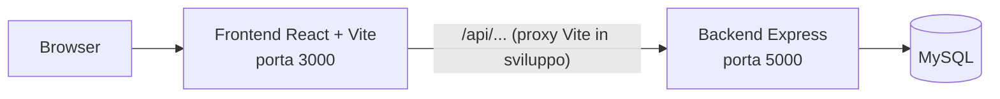

# Balloi Immobiliare

[](https://github.com/danielballoi/balloi-immobiliare/actions/workflows/ci.yml)

Dashboard web per investimenti immobiliari a Cagliari e nell'hinterland: censimento degli immobili, valutazione con dati OMI ufficiali (Osservatorio del Mercato Immobiliare) e gestione di un portafoglio di investimenti. Pensata per chi vuole analizzare zone, valutare un immobile con più metodologie e tenere traccia delle proprie opportunità.

## Funzionalita

- **Autenticazione utenti** con login, registrazione, refresh token e sessione via cookie httpOnly; ruoli `user` e `admin`.
- **Mappa e statistiche OMI**: visualizzazione delle zone di Cagliari e hinterland con heatmap dei prezzi, statistiche per quartiere, trend storici e dettaglio per tipologia di immobile.
- **Valutazione immobili** con tre metodologie: Valutazione Comparativa di Mercato (VCM), Valutazione Reddituale, Analisi Finanziaria/DCF (VAN, TIR, ROI, Cash-on-Cash).
- **Censimento immobili**: schedatura manuale di immobili con note, stato e preferiti.
- **Portafoglio investimenti**: elenco degli immobili valutati e salvati, con riepilogo KPI.
- **Locazioni**: gestione di un registro di immobili in locazione.
- **Import dati**: caricamento CSV di valori OMI, zone, NTN (Numero Transazioni Normalizzate) e inserimento manuale, con log delle importazioni.
- **Stradario**: ricerca vie e quartieri di Cagliari, statistiche collegate.
- **Segnalazioni**: gli utenti possono inviare segnalazioni, consultabili dagli amministratori.
- **Gestione utenze**: approvazione, blocco e riattivazione degli account utente (area admin).

## Stack tecnologico

**Backend**
- Node.js + Express 4
- MySQL (driver `mysql2`)
- Autenticazione: `jsonwebtoken`, `bcryptjs`, `cookie-parser`
- Sicurezza: `helmet`, `express-rate-limit`, CORS con whitelist
- Import dati: `multer`, `papaparse`, `cheerio`

**Frontend**
- React 19 + Vite
- React Router 7
- Tailwind CSS 4
- Leaflet / React-Leaflet (mappe)
- Recharts (grafici)
- Axios

## Architettura



## Prerequisiti

- Node.js >= 18
- MySQL installato e in esecuzione (database creato manualmente prima del primo avvio)

## Avvio con Docker

Il modo piu rapido per far partire l'intero sistema (database, backend e frontend) senza installare Node.js o MySQL sul proprio computer. Servono solo Docker e Docker Compose.

1. Copia il file di esempio delle variabili d'ambiente:

```bash
cp .env.example .env
```

2. Apri `.env` e sostituisci i valori segnaposto: le password del database (`DB_ROOT_PASSWORD`, `DB_PASSWORD`), `JWT_SECRET` (si genera con `openssl rand -hex 64`) e, per creare l'account amministratore al primo avvio, `ADMIN_EMAIL` e `ADMIN_PASSWORD` (almeno 12 caratteri). Il file `.env` non viene versionato.

3. Costruisci le immagini e avvia i container:

```bash
docker compose up --build -d
```

4. Apri http://localhost:8080 e accedi con l'account amministratore configurato.

### Come e composto

- **frontend**: nginx serve l'applicazione React gia compilata e inoltra le richieste `/api/` al backend (reverse proxy). E l'unico servizio raggiungibile dall'esterno, sulla porta 8080.
- **backend**: Node.js/Express, eseguito come utente non-root, con healthcheck su `/api/health`. Raggiungibile solo dalla rete interna di Compose.
- **db**: MySQL 8.4 con un volume dedicato (`db_data`) per la persistenza. Alla prima esecuzione crea le tabelle da `db/schema.sql`. Anche il database e raggiungibile solo dalla rete interna.

I servizi partono in ordine (db, poi backend, poi frontend) e ognuno aspetta che il precedente sia in stato `healthy`.

### Comandi utili

```bash
docker compose ps                # stato dei servizi
docker compose logs -f backend   # log del backend in tempo reale
docker compose down              # ferma e rimuove i container, i dati restano nel volume
docker compose down -v           # ATTENZIONE: rimuove anche il volume, cancella i dati
```

### Nota sui dati

`db/schema.sql` contiene solo la struttura delle tabelle, nessun dato. Al primo avvio il database e quindi vuoto: i dati OMI e le altre informazioni vanno caricati con la funzione di importazione dell'applicazione. I dati reali non sono nel repository.

## Avvio in locale

1. Clonare il repository.
2. Configurare il backend:
   ```bash
   cd backend
   cp .env.example .env
   ```
   Compilare `backend/.env` con i propri valori (credenziali MySQL, `JWT_SECRET`, credenziali admin — vedi tabella sotto). Il file `.env` non va mai committato.
3. Installare le dipendenze e avviare il backend:
   ```bash
   npm install
   npm run dev
   ```
   Il server crea/verifica automaticamente le tabelle al primo avvio e, se `ADMIN_EMAIL`/`ADMIN_PASSWORD` sono valorizzate, crea l'account amministratore.
4. In un secondo terminale, installare e avviare il frontend:
   ```bash
   cd frontend
   npm install
   npm run dev
   ```
5. Verificare che il backend risponda su `http://localhost:5000/api/health` e aprire il frontend su `http://localhost:3000`.

## Variabili d'ambiente

Tutte le variabili sono definite (senza valori reali) in `backend/.env.example`.

| Variabile | Descrizione |
|---|---|
| `DB_HOST` | Host del server MySQL |
| `DB_USER` | Utente MySQL |
| `DB_PASSWORD` | Password MySQL |
| `DB_NAME` | Nome del database |
| `DB_PORT` | Porta MySQL |
| `PORT` | Porta su cui ascolta il backend Express |
| `NODE_ENV` | Ambiente di esecuzione (`development`, `staging`, `production`) |
| `JWT_SECRET` | Chiave segreta per firmare i token JWT |
| `JWT_EXPIRES_IN` | Durata di validita del token JWT |
| `CORS_ORIGINS` | Origini frontend autorizzate dal CORS, separate da virgola |
| `COOKIE_SAMESITE` | Attributo SameSite dei cookie di sessione (default `lax`, adatto quando frontend e backend condividono dominio) |
| `DATI_OMI_PATH` | Percorso locale della cartella dati OMI (solo sviluppo) |
| `ADMIN_EMAIL` | Email dell'account amministratore creato al primo avvio |
| `ADMIN_PASSWORD` | Password dell'account amministratore (minimo 12 caratteri; se mancante o troppo corta il seed viene saltato) |
| `ADMIN_USERNAME` | Username dell'account amministratore |
| `ADMIN_NOME` | Nome visualizzato dell'account amministratore |

## Struttura delle cartelle

```
balloi-immobiiare/
├── backend/
│   ├── server.js          Punto di avvio: configura Express e monta le routes
│   ├── config/db.js        Pool MySQL, creazione tabelle e seed admin
│   ├── controllers/         Logica delle route piu complesse
│   ├── middleware/          Autenticazione, autorizzazione admin
│   ├── models/               Accesso ai dati
│   ├── routes/                 auth, utenze, zone, valori, valutazioni, portafoglio,
│   │                            import, ntn, strade, censimenti, locazioni, segnalazioni
│   ├── services/              Algoritmi di valutazione (VCM, reddituale, DCF)
│   ├── scripts/               Script di utilita (es. reset_admin_password.js)
│   └── migrations/            Migrazioni SQL
└── frontend/
    └── src/
        ├── App.jsx            Router principale
        ├── contexts/           AuthContext
        ├── components/         Componenti riutilizzabili (Layout, Sidebar, ecc.)
        ├── pages/               Una pagina per ciascuna sezione dell'app
        └── services/api.js    Chiamate HTTP centralizzate (Axios)
```

## Sicurezza

- Nessun segreto o credenziale e presente nel codice sorgente: tutti i valori sensibili si configurano tramite variabili d'ambiente (`backend/.env`, mai versionato).
- L'account amministratore non e piu hardcoded: viene creato al primo avvio leggendo `ADMIN_EMAIL` e `ADMIN_PASSWORD` dall'ambiente. E disponibile lo script `backend/scripts/reset_admin_password.js` per reimpostare la password in qualsiasi momento.
- Dati personali (utenti, segnalazioni, backup del database) non vengono mai versionati nel repository.

## Roadmap

- Containerizzazione con Docker e Docker Compose.
- Pipeline di Continuous Integration con GitHub Actions.
- Pubblicazione dell'immagine su GitHub Container Registry (GHCR).
- Deploy su AWS con infrastruttura come codice (Terraform).
- Migrazione del database a PostgreSQL.

## Screenshot

Screenshot: da aggiungere
